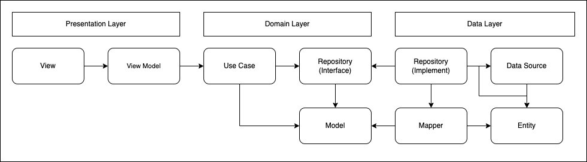

# Simple Weather App

## Tổng quan

Project được áp dụng kiến trúc **(Clean Architecture)** kết hợp với mô hình **MVVM (Model-View-ViewModel)**, sử dụng package **Riverpod** để quản lý trạng thái và **Retrofit** để thực hiện các yêu cầu API.

## Kiến Trúc

Kiến trúc của project được tham khảo từ hình dưới đây:

Cấu trúc thư mục project được chia thành các thư mục như sau:

    lib/
    ├── gen/
    ├── src/
        ├── core/
        │   ├── animation/
        │   ├── api/
        │   ├── base/
        │   │   ├── base_api_remote_datasource.dart
        │   │   ├── base_view.dart
        │   │   ├── base_view_model.dart
        │   │   ├── view_state.dart
        │   ├── config/
        │   ├── constants/
        │   ├── enums/
        │   ├── error/
        │   ├── extensions/
        │   ├── localization/
        │   ├── network/
        │   ├── routes/
        │   ├── service/
        │   ├── theme/
        │   ├── usecases/
        │   └── utils/
        │   └── widgets/
        ├── data/
        │   ├── datasources/
        │   │   ├── local/
        │   │   └── remote/
        │   ├── mappers/
        │   ├── models/
        │   └── repositories/
        ├── di/
        ├── domain/
        │   ├── entities/
        │   │   ├── requests/
        │   │   └── responses/
        │   ├── repositories/
        │   └── usecases/
        └── presentation/
            ├── viewmodels/
            ├── views/
            └── widgets/

## Package

Một số package nổi bật được sử dụng:

- `flutter_riverpod`
- `riverpod_annotation`
- `retrofit`
- `dio`
- `freezed`
- `freezed_annotation`
- `internet_connection_checker`
- `flutter_gen`
- `awesome_dio_interceptor`
- `dartz`

## Tham Khảo

- **UI**
  - [Weather-Design-Daily-UI-037](https://www.behance.net/gallery/204557253/Weather-Design-Daily-UI-037?tracking_source=search_projects%7Cweather+app+mobile)

- **Project**
  - [Flutter-MVVM-Clean-Architecture](https://github.com/M4RZB4Ni/Flutter-MVVM-Clean-Architecture): Dự án Flutter dựa trên MVVM + DI + Clean Architecture + GetX
  - [weather-flutter](https://github.com/SamedHrmn/weather-flutter?ref=flutterawesome.com): Dự án Flutter về thời tiết đơn giản sử dụng api open-meteo.

## Lưu Ý

> Nên comment lại package `flutter_gen` trong `pubspec.yaml` sau mỗi khi cần gen lại assets hay retrofit vì package `flutter_gen` conflict với package trong phần code đa ngôn ngữ
